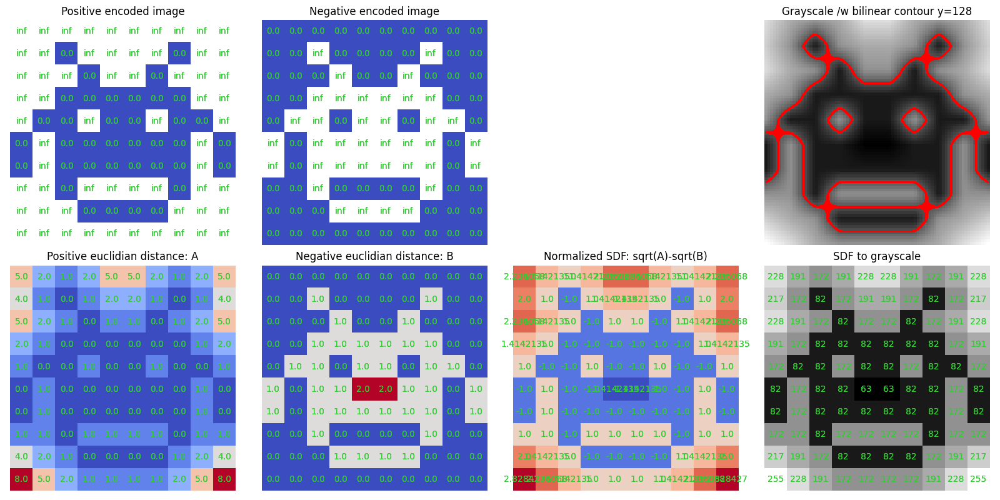
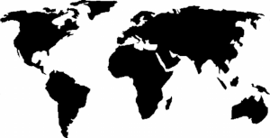
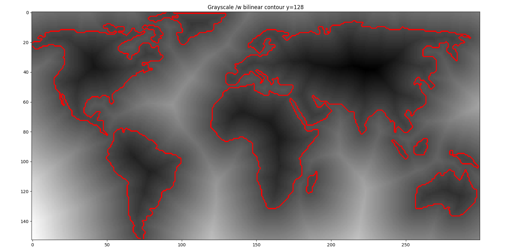
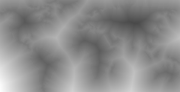

# Naive SDF generation in Python

Very naive SDF implementation inspired by https://prideout.net/blog/distance_fields/, without the hull construction.

Converts any image to BW, and thresholds it at value 128.  
Displays the contour and outputs the SDF as a uint8 PNG.

Example: `$ python sdf_gen.py world.png`

  
   
   

